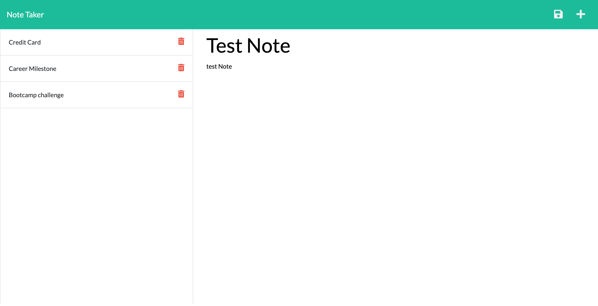
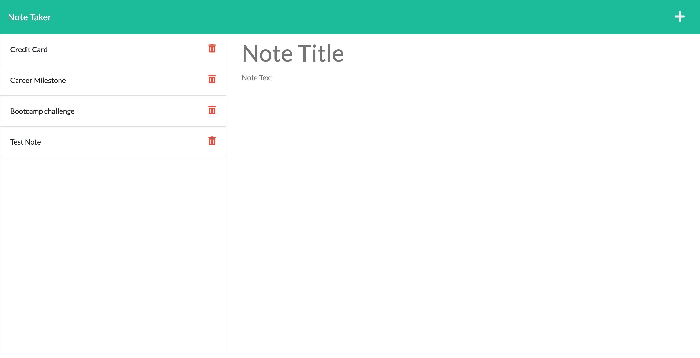

# NOTE DOWN APPLICATION

## PROJECT DESCRIPTION

 

This is a note down application used to write and save notes.
This Project creates a backend for the application using Express.js.  
Express.js defines the route to view the notes,to save the notes and delete the notes.

- When the user enter /notes or click on the Take Note Button,application will display the notes  
  by making a fetch call to server and server using the defined GET route return the saved notes from db file.

- When the user click on save button,a fetch call goes to the backend which will save the new note with the
  unique id using the helper module to the json file using the defined POST route and return the new note as response.

- When the user click on  the delete button,a fetch call goes to server with the id and server using the defined DELETE route
  remove the note from json and update the page.

### Links

 

Github Repo Link : https://github.com/simmypayyappillyvarghese/note-down-app

### Technologies and Packages Used

 

*   [x] EXPRESS PACKAGE
*   [x] FS PACKAGE
*   [x] NODE JS
*   [x] NPM PACKAGE
*   [x] HTML,CSS

 

### Screenshot

Screenshot of Creating and Saving the Note

 

 

